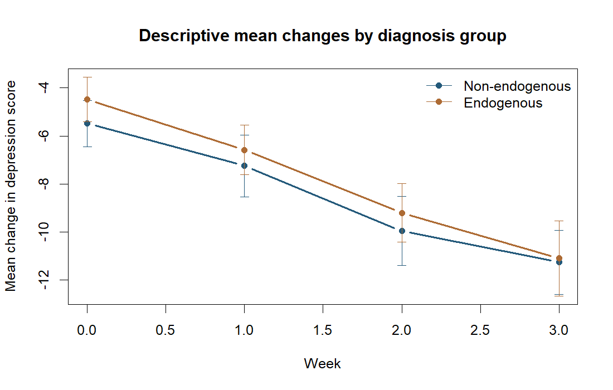

# Depression Trajectories and Drug Concentration

Model changes in depression scores over four weeks and examine how trajectories vary with plasma desipramine concentration.

**Author:** Heyang Ma · Independent UCLA graduate course project, revised for this portfolio.
**Tools:** R / nlme, Mixed effects models, Repeated measurements. **Scope:** 66 subjects · 250 observations.

## Question

How are changes in depression scores associated with diagnosis and measured drug concentration after accounting for repeated observations?

## What I did

I compared longitudinal mean and covariance structures with mixed effects models, then estimated the association between week, diagnosis, and observed plasma desipramine concentration while accounting for repeated measurements.

## Main finding

For the selected random intercept and slope model, the week × desipramine coefficient was −0.887 (95% CI −1.551 to −0.224; p = 0.009). This coefficient is on the dataset’s recorded concentration scale; it is not a treatment effect or a dosing recommendation.



_Descriptive weekly means by diagnosis group; the reported week × desipramine coefficient comes from the mixed effects model._

## Important limitations

Drug concentrations are observed, time-varying measurements. The model does not establish causation or separate within-person from between-person concentration effects. The sample is small, and reported intervals do not account for model selection.

## Code and reproducibility

Use R 4.5.2; the recommended package `nlme` is required.
Read [data access and input requirements](DATA_ACCESS.md), then run from this repository:

```sh
Rscript analysis.R data/riesby.csv results
```


The executable analysis is [analysis.R](analysis.R). See [REPORT.md](REPORT.md) for model details and interpretation, [DATA_ACCESS.md](DATA_ACCESS.md) for inputs, and [REVISION_NOTES.md](REVISION_NOTES.md) for the distinction between the course project and portfolio revision. The committed `results/` files are generated summaries from the revision.

